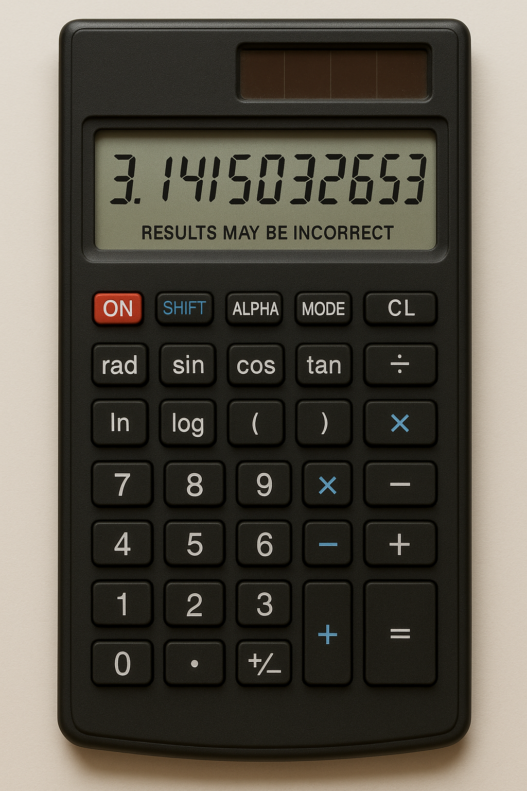
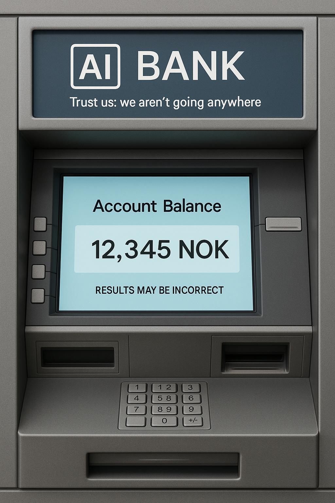
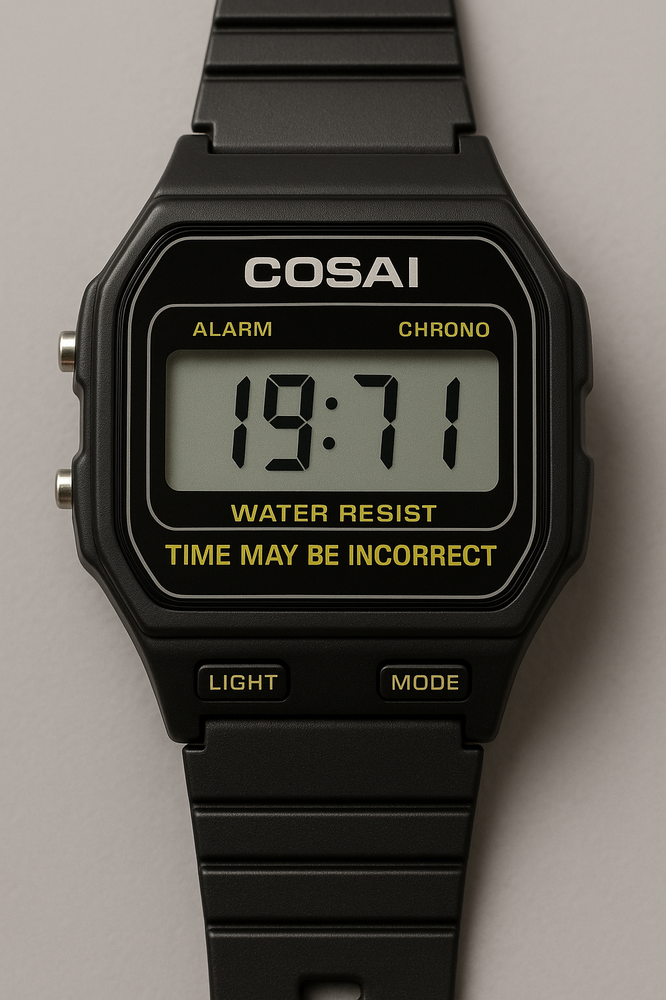
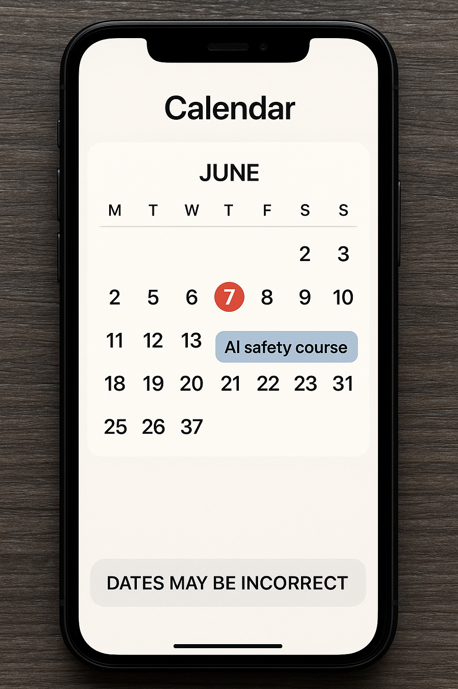

# AI Tech

A series of social media posts about reliable physical technology being ruined by a classic generative AI disclaimer, "Results may be incorrect" (also 'Double-check the output' or 'AI can make mistakes', etc). The point is that while some AI applications may be fine, certain others are probably not.

### Been using this AI-powered calculator for a week now and 10/9.7 would recommend

### Cannot recommend AI Bank highly enough, they hardly lose any of my money!

### Got this awesome AI-powered watch ("It's time for AI!") for my birthday and it's actually pretty cool. I often know the approximate time.

### Lifehack! Started using this AI-powered calendar app tomorrow and I have way more time to myself now

